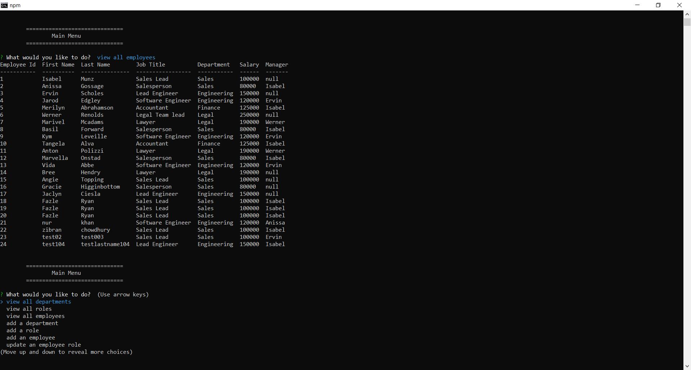

# EmployeeTracker

## Screenshot:

## DESCRIPTION: 
AS A business owner
user will be able to view and manage the departments, roles, and employees in the company with this application
SO THAT he/she can organize and plan business.

## INSTALLATION
USER can run 'source schema.sql' to create the database and table if it does not exist.
USER can run 'source seeds.sql' to populate tables with dummy values.

## USAGE:
GIVEN a command-line application that accepts user input
WHEN user start the application
THEN the user is presented with the following options: view all departments, view all roles, view all employees, add a department, add a role, add an employee, update an employee role, update employee managers, view employees by manager, view employees by department, delete department, role and employee, view the total utilized budget and exit.
WHEN user choose to view all departments
THEN user is presented with a formatted table showing department names and department ids.
WHEN user choose to view all roles
THEN user is presented with the job title, role id, the department that role belongs to, and the salary for that role.
WHEN user choose to view all employees
THEN the user is presented with a formatted table showing employee data, including employee ids, first names, last names, job titles, departments, salaries, and managers that the employees report to.
WHEN user choose to add a department
THEN user is prompted to enter the name of the department and that department is added to the database.
WHEN user choose to add a role
THEN the user is prompted to enter the name, salary, and department for the role and that role is added to the database
WHEN user choose to add an employee.
THEN user is prompted to enter the employee’s first name, last name, role, and manager and that employee is added to the database.
WHEN user choose to update an employee role
THEN user is prompted to select an employee to update and their new role and this information is updated in the database.
WHEN user choose to update an employee's manager
THEN user is promted to select the employee and then the new manager and this information is updated in the database.
WHEN user choose to view employees by manager,
THEN user is presented with a formatted table of employee id, employee's first name, last name and manager's first name if manager exists otherwise prints null.
WHEN user choose to view employees by department,
THEN user is presented with a formatted table of employee id, employee's first name, last name, job title and corresponding department.
WHEN user choose to delete then user is promted to select which would he/she like to delete: deparment/role/employee. 
THEN when user selects any of the options, USER is promted with the name of the department or name of the role or name of the employee to delete and THEN database is updated.
WHEN user choose to view the total utilized budget,
THEN user is presented with a formatted table showing a list of department and combined salaries of all employees in that department.

## TECHNICAL DESCRIPTION: 
- mysql2 package, inquirer package and console.table package (to present formatted tables) are used.

## WALKTHROUGH VIDEO:
https://drive.google.com/file/d/1cPxqgw3v6PrsA2EKwaXdV_fIFU9gUUMm/view